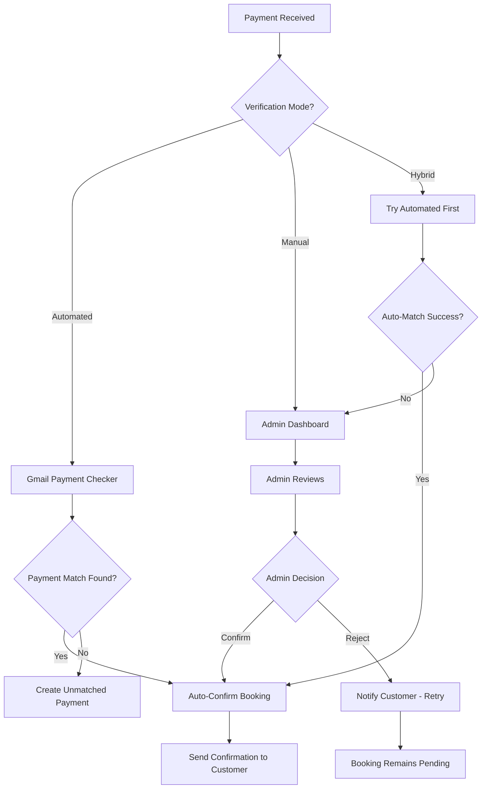

# Design Document: Automated Payment Verification System

## Overview

This document outlines the technical design for implementing an automated payment verification system with multiple verification modes. The system will integrate Gmail-based payment detection, web-based admin verification, and automated booking expiration with customer notifications.

### Design Goals

- **Modularity**: Separate concerns into distinct services and repositories
- **Configurability**: Support multiple verification modes via configuration
- **Backward Compatibility**: Maintain existing booking flow and API contracts
- **Scalability**: Design for future payment gateway integrations
- **Reliability**: Implement robust error handling and fallback mechanisms

### Architecture Principles

- Follow existing layered architecture (API → Service → Repository → Model)
- Use dependency injection for testability
- Implement async operations for external API calls (Gmail, WhatsApp)
- Maintain transaction integrity with proper rollback mechanisms
- Log all payment operations for audit trail

---

## Architecture

### High-Level Architecture

```
┌─────────────────────────────────────────────────────────────┐
│                     API Layer (FastAPI)                      │
│  ┌──────────────┐  ┌──────────────┐  ┌──────────────┐      │
│  │ Admin API    │  │ Webhook API  │  │ Demo API     │      │
│  │ /admin/*     │  │ /webhooks/*  │  │ /demo/*      │      │
│  └──────────────┘  └──────────────┘  └──────────────┘      │
└─────────────────────────────────────────────────────────────┘
                              │
                              ▼
┌─────────────────────────────────────────────────────────────┐
│                     Service Layer                            │
│  ┌──────────────────┐  ┌──────────────────┐                │
│  │ Payment          │  │ Gmail            │                │
│  │ Verification     │  │ Integration      │                │
│  │ Service          │  │ Service          │                │
│  └──────────────────┘  └──────────────────┘                │
│  ┌──────────────────┐  ┌──────────────────┐                │
│  │ Notification     │  │ Booking          │                │
│  │ Service          │  │ Service          │                │
│  └──────────────────┘  └──────────────────┘                │
└─────────────────────────────────────────────────────────────┘
                              │
                              ▼
┌─────────────────────────────────────────────────────────────┐
│                   Repository Layer                           │
│  ┌──────────────┐  ┌──────────────┐  ┌──────────────┐      │
│  │ Payment      │  │ Booking      │  │ Message      │      │
│  │ Repository   │  │ Repository   │  │ Repository   │      │
│  └──────────────┘  └──────────────┘  └──────────────┘      │
└─────────────────────────────────────────────────────────────┘
                              │
                              ▼
┌─────────────────────────────────────────────────────────────┐
│                     Data Layer (PostgreSQL)                  │
│  ┌──────────────┐  ┌──────────────┐  ┌──────────────┐      │
│  │ payments     │  │ bookings     │  │ messages     │      │
│  └──────────────┘  └──────────────┘  └──────────────┘      │
└─────────────────────────────────────────────────────────────┘

┌─────────────────────────────────────────────────────────────┐
│                  Background Jobs (APScheduler)               │
│  ┌──────────────────┐  ┌──────────────────┐                │
│  │ Gmail Payment    │  │ Booking          │                │
│  │ Checker          │  │ Expiration       │                │
│  │ (Every 2 min)    │  │ (Every 5 min)    │                │
│  └──────────────────┘  └──────────────────┘                │
└─────────────────────────────────────────────────────────────┘
```

### Verification Mode Flow



---

## Components and Interfaces

### 1. Configuration Management

**File**: `app/core/config.py` (extend existing)

```python
class Settings(BaseSettings):
    # Existing settings...
    
    # Payment Verification Settings
    VERIFICATION_MODE: str = "manual"  # "automated", "manual", "hybrid"
    GMAIL_ENABLED: bool = False
    GMAIL_CREDENTIALS_PATH: str = "credentials.json"
    GMAIL_TOKEN_PATH: str = "token.json"
    GMAIL_CHECK_INTERVAL_MINUTES: int = 2
    BOOKING_EXPIRATION_MINUTES: int = 15
    BOOKING_EXPIRATION_CHECK_INTERVAL_MINUTES: int = 5
    
    # Payment Provider Settings
    PAYMENT_PROVIDER_EMAIL: str = "nayapay@example.com"
    PAYMENT_PROVIDER_NAME: str = "NayaPay"
```


### 2. Database Models

**File**: `app/chatbot/models.py` (extend existing)

#### Payment Model (New)

```python
class Payment(Base):
    __tablename__ = "payments"
    
    payment_id = Column(UUID(as_uuid=True), primary_key=True, default=uuid.uuid4)
    booking_id = Column(Text, ForeignKey("bookings.booking_id"), nullable=True)
    
    # Payment source and data
    source = Column(Enum("gmail", "screenshot", "manual", name="payment_source_enum"), nullable=False)
    transaction_id = Column(String(100), nullable=True, index=True)
    amount = Column(Numeric(10, 2), nullable=False)
    sender_name = Column(String(100), nullable=True)
    sender_phone = Column(String(20), nullable=True)
    
    # Gmail-specific fields
    email_id = Column(String(100), nullable=True, unique=True)  # Gmail message ID
    email_subject = Column(Text, nullable=True)
    email_body = Column(Text, nullable=True)
    
    # Screenshot-specific fields
    screenshot_url = Column(Text, nullable=True)
    screenshot_data = Column(JSON, nullable=True)  # Extracted data from AI
    
    # Status tracking
    status = Column(
        Enum("pending", "matched", "unmatched", "verified", "rejected", name="payment_status_enum"),
        default="pending"
    )
    match_confidence = Column(Numeric(5, 2), nullable=True)  # 0-100 score
    
    # Audit fields
    created_at = Column(DateTime, default=datetime.utcnow)
    updated_at = Column(DateTime, default=datetime.utcnow, onupdate=datetime.utcnow)
    verified_at = Column(DateTime, nullable=True)
    verified_by = Column(String(100), nullable=True)
    
    # Relationships
    booking = relationship("Booking", backref="payments")
```

#### Booking Model Updates (Extend existing)

```python
class Booking(Base):
    # Existing fields...
    
    # New payment-related fields
    payment_id = Column(UUID(as_uuid=True), ForeignKey("payments.payment_id"), nullable=True)
    payment_verified_at = Column(DateTime, nullable=True)
    verification_method = Column(
        Enum("auto_gmail", "auto_screenshot", "manual_admin", name="verification_method_enum"),
        nullable=True
    )
    expiration_notified_at = Column(DateTime, nullable=True)
    rejection_reason = Column(Text, nullable=True)
```

### 3. Gmail Integration Service

**File**: `app/services/gmail_service.py` (New)

```python
class GmailService:
    """
    Service for integrating with Gmail API to fetch and parse payment emails.
    """
    
    def __init__(self, credentials_path: str, token_path: str):
        self.credentials_path = credentials_path
        self.token_path = token_path
        self.service = None
    
    async def authenticate(self) -> bool:
        """Authenticate with Gmail API using OAuth2."""
        pass
    
    async def fetch_unread_payment_emails(
        self,
        sender_email: str,
        max_results: int = 10
    ) -> List[Dict[str, Any]]:
        """
        Fetch unread emails from payment provider.
        Returns list of email data dictionaries.
        """
        pass
    
    async def parse_payment_email(
        self,
        email_data: Dict[str, Any]
    ) -> Optional[Dict[str, Any]]:
        """
        Parse payment email to extract structured data.
        Returns: {
            'email_id': str,
            'transaction_id': str,
            'amount': float,
            'sender_name': str,
            'sender_phone': str,
            'date': datetime,
            'subject': str,
            'body': str
        }
        """
        pass
    
    async def mark_as_read(self, email_id: str) -> bool:
        """Mark email as read to prevent reprocessing."""
        pass
```


### 4. Payment Verification Service

**File**: `app/services/payment_verification_service.py` (New)

```python
class PaymentVerificationService:
    """
    Core service for payment verification logic.
    Handles automated matching, manual verification, and hybrid mode.
    """
    
    def __init__(
        self,
        payment_repo: PaymentRepository,
        booking_repo: BookingRepository,
        notification_service: NotificationService,
        config: Settings
    ):
        self.payment_repo = payment_repo
        self.booking_repo = booking_repo
        self.notification_service = notification_service
        self.config = config
    
    async def process_gmail_payment(
        self,
        db: Session,
        payment_data: Dict[str, Any]
    ) -> Dict[str, Any]:
        """
        Process payment detected from Gmail.
        1. Create payment record
        2. Try to match with pending booking
        3. Auto-confirm if match found (in automated/hybrid mode)
        4. Create unmatched payment if no match
        """
        pass
    
    async def match_payment_to_booking(
        self,
        db: Session,
        payment: Payment
    ) -> Optional[Tuple[Booking, float]]:
        """
        Match payment to pending booking.
        Returns: (booking, confidence_score) or None
        
        Matching criteria:
        - Amount exact match (required)
        - Booking age < 15 minutes (required)
        - Customer name similarity (optional, +20 points)
        - Customer phone match (optional, +30 points)
        
        Confidence score: 0-100
        - 50: Amount + timing match only
        - 70: Amount + timing + name match
        - 100: Amount + timing + name + phone match
        """
        pass
    
    async def auto_confirm_booking(
        self,
        db: Session,
        booking: Booking,
        payment: Payment,
        confidence: float
    ) -> Dict[str, Any]:
        """
        Auto-confirm booking after successful payment match.
        1. Update booking status to "Confirmed"
        2. Link payment to booking
        3. Update payment status to "verified"
        4. Send confirmation notification to customer
        """
        pass
    
    async def create_unmatched_payment(
        self,
        db: Session,
        payment: Payment
    ) -> Dict[str, Any]:
        """
        Create unmatched payment record for admin review.
        1. Set payment status to "unmatched"
        2. Notify admin about unmatched payment
        """
        pass
    
    async def manual_verify_payment(
        self,
        db: Session,
        booking_id: str,
        verified_by: str
    ) -> Dict[str, Any]:
        """
        Manually verify payment (admin action).
        1. Update booking status to "Confirmed"
        2. Update payment status to "verified"
        3. Send confirmation to customer
        """
        pass
    
    async def reject_payment(
        self,
        db: Session,
        booking_id: str,
        reason: str,
        rejected_by: str
    ) -> Dict[str, Any]:
        """
        Reject payment (admin action).
        1. Update booking status back to "Pending"
        2. Update payment status to "rejected"
        3. Send rejection notification to customer with reason
        """
        pass
```


### 5. Payment Repository

**File**: `app/repositories/payment_repository.py` (New)

```python
class PaymentRepository:
    """
    Repository for payment data access operations.
    """
    
    def create_payment(
        self,
        db: Session,
        payment_data: Dict[str, Any]
    ) -> Payment:
        """Create new payment record."""
        pass
    
    def get_by_id(
        self,
        db: Session,
        payment_id: str
    ) -> Optional[Payment]:
        """Get payment by ID."""
        pass
    
    def get_by_transaction_id(
        self,
        db: Session,
        transaction_id: str
    ) -> Optional[Payment]:
        """Get payment by transaction ID."""
        pass
    
    def get_by_email_id(
        self,
        db: Session,
        email_id: str
    ) -> Optional[Payment]:
        """Get payment by Gmail message ID."""
        pass
    
    def get_unmatched_payments(
        self,
        db: Session,
        limit: int = 50
    ) -> List[Payment]:
        """Get all unmatched payments for admin review."""
        pass
    
    def update_status(
        self,
        db: Session,
        payment_id: str,
        status: str
    ) -> Payment:
        """Update payment status."""
        pass
    
    def link_to_booking(
        self,
        db: Session,
        payment_id: str,
        booking_id: str
    ) -> Payment:
        """Link payment to booking."""
        pass
```

### 6. Admin Dashboard API

**File**: `app/api/v1/admin.py` (Extend existing)

```python
@router.get("/pending-verifications")
async def get_pending_verifications(
    db: Session = Depends(get_db),
    current_admin: User = Depends(get_current_admin)
):
    """
    Get all bookings waiting for payment verification.
    Returns bookings with status "Waiting" and their payment details.
    """
    pass

@router.get("/booking/{booking_id}/details")
async def get_booking_verification_details(
    booking_id: str,
    db: Session = Depends(get_db),
    current_admin: User = Depends(get_current_admin)
):
    """
    Get detailed information for a booking pending verification.
    Includes: booking details, customer info, payment screenshot, payment data.
    """
    pass

@router.post("/booking/{booking_id}/confirm")
async def confirm_booking_payment(
    booking_id: str,
    db: Session = Depends(get_db),
    current_admin: User = Depends(get_current_admin)
):
    """
    Confirm booking payment after admin verification.
    """
    pass

@router.post("/booking/{booking_id}/reject")
async def reject_booking_payment(
    booking_id: str,
    rejection_data: RejectPaymentRequest,
    db: Session = Depends(get_db),
    current_admin: User = Depends(get_current_admin)
):
    """
    Reject booking payment with reason.
    """
    pass

@router.get("/unmatched-payments")
async def get_unmatched_payments(
    db: Session = Depends(get_db),
    current_admin: User = Depends(get_current_admin)
):
    """
    Get all unmatched payments (Gmail payments with no booking match).
    """
    pass

@router.post("/payment/{payment_id}/link-booking")
async def link_payment_to_booking(
    payment_id: str,
    link_data: LinkPaymentRequest,
    db: Session = Depends(get_db),
    current_admin: User = Depends(get_current_admin)
):
    """
    Manually link an unmatched payment to a booking.
    """
    pass
```


### 7. Background Jobs

**File**: `app/tasks/payment_tasks.py` (New)

```python
async def check_gmail_payments():
    """
    Background job to check Gmail for new payment emails.
    Runs every 2 minutes (configurable).
    
    Process:
    1. Fetch unread payment emails from Gmail
    2. Parse each email to extract payment data
    3. Create payment record in database
    4. Try to match with pending bookings
    5. Auto-confirm if match found (in automated/hybrid mode)
    6. Mark email as read
    """
    pass

async def expire_pending_bookings():
    """
    Background job to expire old pending bookings.
    Runs every 5 minutes (configurable).
    
    Process:
    1. Find bookings with status "Pending" older than 15 minutes
    2. Update status to "Expired"
    3. Send expiration notification to customer
    4. Log expiration for audit
    """
    pass
```

**File**: `app/tasks/scheduler.py` (Extend existing)

```python
def start_payment_scheduler():
    """
    Start background scheduler for payment-related jobs.
    """
    global scheduler
    
    if scheduler is None:
        scheduler = BackgroundScheduler()
    
    # Add Gmail payment checker (every 2 minutes)
    if settings.GMAIL_ENABLED:
        scheduler.add_job(
            func=check_gmail_payments,
            trigger="interval",
            minutes=settings.GMAIL_CHECK_INTERVAL_MINUTES,
            id='gmail_payment_checker',
            name='Gmail Payment Checker',
            replace_existing=True
        )
    
    # Add booking expiration job (every 5 minutes)
    scheduler.add_job(
        func=expire_pending_bookings,
        trigger="interval",
        minutes=settings.BOOKING_EXPIRATION_CHECK_INTERVAL_MINUTES,
        id='booking_expiration',
        name='Booking Expiration Job',
        replace_existing=True
    )
    
    scheduler.start()
```

### 8. Notification Service Updates

**File**: `app/services/notification_service.py` (Extend existing)

```python
class NotificationService:
    # Existing methods...
    
    async def notify_booking_expired(
        self,
        db: Session,
        booking: Booking
    ) -> Dict[str, Any]:
        """
        Notify customer that their booking has expired.
        
        Message includes:
        - Booking details
        - Expiration reason (15 minutes timeout)
        - Instructions to create new booking
        - Payment instructions if they want to rebook
        """
        pass
    
    async def notify_admin_unmatched_payment(
        self,
        db: Session,
        payment: Payment
    ) -> Dict[str, Any]:
        """
        Notify admin about unmatched payment from Gmail.
        
        Message includes:
        - Payment details (amount, sender, transaction ID)
        - Timestamp
        - Request to manually link to booking
        """
        pass
    
    async def notify_auto_confirmation(
        self,
        db: Session,
        booking: Booking,
        payment: Payment,
        confidence: float
    ) -> Dict[str, Any]:
        """
        Notify customer about auto-confirmed booking.
        
        Message includes:
        - Confirmation status
        - Booking details
        - Payment details
        - Confidence score (for transparency)
        - Property contact information
        """
        pass
```


---

## Data Models

### Payment Data Model

```python
{
    "payment_id": "uuid",
    "booking_id": "string or null",
    "source": "gmail | screenshot | manual",
    "transaction_id": "string or null",
    "amount": "decimal",
    "sender_name": "string or null",
    "sender_phone": "string or null",
    "email_id": "string or null",
    "email_subject": "string or null",
    "email_body": "text or null",
    "screenshot_url": "string or null",
    "screenshot_data": "json or null",
    "status": "pending | matched | unmatched | verified | rejected",
    "match_confidence": "decimal 0-100 or null",
    "created_at": "datetime",
    "updated_at": "datetime",
    "verified_at": "datetime or null",
    "verified_by": "string or null"
}
```

### Booking Updates

```python
{
    # Existing fields...
    "payment_id": "uuid or null",
    "payment_verified_at": "datetime or null",
    "verification_method": "auto_gmail | auto_screenshot | manual_admin or null",
    "expiration_notified_at": "datetime or null",
    "rejection_reason": "text or null"
}
```

### Gmail Payment Email Structure

```python
{
    "email_id": "gmail_message_id",
    "subject": "Payment Received - NayaPay",
    "from": "nayapay@example.com",
    "date": "datetime",
    "body": "text",
    "parsed_data": {
        "transaction_id": "TXN123456",
        "amount": 5000.00,
        "sender_name": "John Doe",
        "sender_phone": "+923001234567",
        "receiver_account": "03001234567",
        "timestamp": "datetime"
    }
}
```

### Admin Dashboard Response Models

```python
# Pending Verification Response
{
    "bookings": [
        {
            "booking_id": "string",
            "property": {
                "name": "string",
                "type": "hut | farm",
                "address": "string"
            },
            "customer": {
                "name": "string",
                "phone": "string",
                "cnic": "string or null"
            },
            "booking_details": {
                "date": "date",
                "shift": "Day | Night | Full Day | Full Night",
                "total_cost": "decimal"
            },
            "payment": {
                "screenshot_url": "string or null",
                "transaction_id": "string or null",
                "amount": "decimal or null",
                "sender_name": "string or null"
            },
            "status": "Waiting",
            "created_at": "datetime"
        }
    ],
    "count": "integer"
}

# Unmatched Payment Response
{
    "payments": [
        {
            "payment_id": "uuid",
            "source": "gmail",
            "transaction_id": "string",
            "amount": "decimal",
            "sender_name": "string",
            "sender_phone": "string",
            "email_subject": "string",
            "created_at": "datetime",
            "status": "unmatched"
        }
    ],
    "count": "integer"
}
```


---

## Error Handling

### Error Categories

1. **Gmail API Errors**
   - Authentication failure → Log error, disable Gmail checking temporarily
   - Rate limit exceeded → Implement exponential backoff
   - Network timeout → Retry with backoff, fallback to manual mode
   - Invalid credentials → Alert admin, disable Gmail integration

2. **Payment Matching Errors**
   - No matching booking found → Create unmatched payment record
   - Multiple matches with same confidence → Select most recent booking
   - Database transaction failure → Rollback, log error, retry once

3. **Notification Errors**
   - WhatsApp API failure → Fallback to web message, log error
   - Message save failure → Retry once, log error if still fails
   - Customer unreachable → Log for manual follow-up

4. **Background Job Errors**
   - Job execution failure → Log error, continue to next cycle
   - Database connection lost → Reconnect, retry operation
   - Scheduler crash → Auto-restart with exponential backoff

### Error Response Format

```python
{
    "success": False,
    "error": {
        "code": "PAYMENT_MATCH_FAILED",
        "message": "Could not match payment to any pending booking",
        "details": {
            "payment_id": "uuid",
            "amount": 5000.00,
            "reason": "No pending bookings with matching amount"
        },
        "timestamp": "datetime"
    }
}
```

### Fallback Mechanisms

1. **Gmail Integration Failure**
   - Fallback to manual verification mode
   - Log error for admin review
   - Continue accepting screenshot payments

2. **Auto-Matching Failure**
   - Create unmatched payment record
   - Notify admin for manual review
   - Keep booking in "Pending" state

3. **Notification Failure**
   - Retry once with exponential backoff
   - Log failure for manual follow-up
   - Store notification in database for later retry

4. **Database Failure**
   - Rollback transaction
   - Log error with full context
   - Return error to caller
   - Retry operation once

---

## Testing Strategy

### Unit Tests

1. **Gmail Service Tests**
   - Test email parsing with various formats
   - Test authentication flow
   - Test error handling for API failures
   - Mock Gmail API responses

2. **Payment Verification Service Tests**
   - Test payment matching algorithm
   - Test confidence score calculation
   - Test auto-confirmation logic
   - Test unmatched payment creation
   - Test manual verification flow

3. **Repository Tests**
   - Test CRUD operations for payments
   - Test query methods (unmatched payments, etc.)
   - Test transaction handling
   - Test constraint violations

4. **Background Job Tests**
   - Test Gmail payment checker logic
   - Test booking expiration logic
   - Test scheduler configuration
   - Mock external dependencies

### Integration Tests

1. **End-to-End Payment Flow**
   - Create booking → Submit payment → Auto-match → Confirm
   - Create booking → Submit payment → No match → Admin review → Confirm
   - Create booking → Wait 15 min → Expire → Notify customer

2. **Admin Dashboard Flow**
   - Get pending verifications → View details → Confirm payment
   - Get pending verifications → View details → Reject payment
   - Get unmatched payments → Link to booking → Confirm

3. **Notification Flow**
   - Test WhatsApp notifications
   - Test web chat notifications
   - Test notification fallbacks
   - Test notification retry logic

4. **Error Scenarios**
   - Gmail API failure during payment check
   - Database failure during auto-confirmation
   - Notification failure after confirmation
   - Multiple concurrent payment submissions

### Test Data

```python
# Sample test booking
{
    "booking_id": "TEST-001",
    "user_id": "test-user-uuid",
    "property_id": "test-property-uuid",
    "booking_date": "2025-10-20",
    "shift_type": "Day",
    "total_cost": 5000.00,
    "status": "Pending",
    "created_at": "2025-10-17T10:00:00"
}

# Sample test payment (Gmail)
{
    "email_id": "gmail-msg-123",
    "transaction_id": "TXN123456",
    "amount": 5000.00,
    "sender_name": "John Doe",
    "sender_phone": "+923001234567",
    "source": "gmail"
}

# Sample test payment (Screenshot)
{
    "screenshot_url": "https://example.com/screenshot.jpg",
    "amount": 5000.00,
    "sender_name": "John Doe",
    "source": "screenshot"
}
```


---

## Security Considerations

### Authentication & Authorization

1. **Admin Dashboard Access**
   - Require admin authentication for all admin endpoints
   - Implement role-based access control (RBAC)
   - Use JWT tokens with expiration
   - Log all admin actions for audit trail

2. **Gmail API Credentials**
   - Store credentials securely (environment variables or secrets manager)
   - Use OAuth2 with refresh tokens
   - Implement token rotation
   - Never expose credentials in logs or responses

3. **Payment Data Protection**
   - Encrypt sensitive payment data at rest
   - Use HTTPS for all API communications
   - Sanitize payment data in logs
   - Implement data retention policies

### Data Validation

1. **Payment Data Validation**
   - Validate amount is positive and reasonable
   - Validate phone numbers format
   - Sanitize transaction IDs
   - Validate email addresses

2. **Booking Data Validation**
   - Verify booking exists before processing payment
   - Check booking status is "Pending" or "Waiting"
   - Validate booking hasn't expired
   - Prevent duplicate payment processing

3. **Admin Input Validation**
   - Validate booking IDs format
   - Sanitize rejection reasons
   - Validate payment IDs
   - Prevent SQL injection

### Rate Limiting

1. **API Endpoints**
   - Limit admin API calls per minute
   - Limit payment submission per user
   - Implement exponential backoff for retries

2. **Gmail API**
   - Respect Gmail API rate limits
   - Implement request throttling
   - Use batch operations where possible

### Audit Logging

1. **Payment Operations**
   - Log all payment creations
   - Log all payment matches
   - Log all auto-confirmations
   - Log all manual verifications

2. **Admin Actions**
   - Log all admin confirmations
   - Log all admin rejections
   - Log all manual payment links
   - Include admin user ID and timestamp

3. **Background Jobs**
   - Log job start and completion
   - Log errors and exceptions
   - Log processing statistics
   - Monitor job execution time

---

## Performance Considerations

### Database Optimization

1. **Indexes**
   - Index `payments.transaction_id` for fast lookup
   - Index `payments.email_id` for duplicate prevention
   - Index `payments.status` for filtering
   - Index `bookings.status` and `bookings.created_at` for expiration queries
   - Composite index on `bookings(status, created_at)` for expiration job

2. **Query Optimization**
   - Use eager loading for related entities (booking.property, booking.user)
   - Limit result sets with pagination
   - Use database-level filtering instead of application-level
   - Cache frequently accessed data (property details, user info)

3. **Connection Pooling**
   - Configure appropriate pool size for background jobs
   - Use separate connection pool for API requests
   - Monitor connection usage and adjust as needed

### Background Job Optimization

1. **Gmail Payment Checker**
   - Process emails in batches
   - Use async operations for API calls
   - Limit max emails per run (e.g., 50)
   - Skip already processed emails efficiently

2. **Booking Expiration Job**
   - Use efficient date range queries
   - Process in batches to avoid long transactions
   - Limit notifications per run to avoid rate limits
   - Use bulk update operations where possible

3. **Job Scheduling**
   - Stagger job execution to avoid resource contention
   - Monitor job execution time and adjust intervals
   - Implement job timeout to prevent hanging
   - Use job queues for better scalability

### Caching Strategy

1. **Configuration Cache**
   - Cache verification mode setting
   - Cache Gmail credentials
   - Invalidate cache on configuration change

2. **Data Cache**
   - Cache property details (rarely change)
   - Cache user information (session-based)
   - Use Redis for distributed caching
   - Implement cache invalidation strategy

### Monitoring Metrics

1. **Payment Metrics**
   - Payment processing time
   - Auto-match success rate
   - Unmatched payment count
   - Manual verification time

2. **Job Metrics**
   - Gmail check execution time
   - Emails processed per run
   - Booking expiration count
   - Job failure rate

3. **API Metrics**
   - Admin dashboard response time
   - API error rate
   - Notification delivery rate
   - Database query performance


---

## Migration Strategy

### Database Migration

1. **Phase 1: Add Payment Table**
   ```sql
   CREATE TABLE payments (
       payment_id UUID PRIMARY KEY DEFAULT uuid_generate_v4(),
       booking_id TEXT REFERENCES bookings(booking_id),
       source VARCHAR(20) NOT NULL,
       transaction_id VARCHAR(100),
       amount NUMERIC(10, 2) NOT NULL,
       sender_name VARCHAR(100),
       sender_phone VARCHAR(20),
       email_id VARCHAR(100) UNIQUE,
       email_subject TEXT,
       email_body TEXT,
       screenshot_url TEXT,
       screenshot_data JSONB,
       status VARCHAR(20) DEFAULT 'pending',
       match_confidence NUMERIC(5, 2),
       created_at TIMESTAMP DEFAULT NOW(),
       updated_at TIMESTAMP DEFAULT NOW(),
       verified_at TIMESTAMP,
       verified_by VARCHAR(100)
   );
   
   CREATE INDEX idx_payments_transaction_id ON payments(transaction_id);
   CREATE INDEX idx_payments_email_id ON payments(email_id);
   CREATE INDEX idx_payments_status ON payments(status);
   CREATE INDEX idx_payments_booking_id ON payments(booking_id);
   ```

2. **Phase 2: Update Bookings Table**
   ```sql
   ALTER TABLE bookings
   ADD COLUMN payment_id UUID REFERENCES payments(payment_id),
   ADD COLUMN payment_verified_at TIMESTAMP,
   ADD COLUMN verification_method VARCHAR(50),
   ADD COLUMN expiration_notified_at TIMESTAMP,
   ADD COLUMN rejection_reason TEXT;
   
   CREATE INDEX idx_bookings_status_created ON bookings(status, created_at);
   ```

3. **Phase 3: Create Enums**
   ```sql
   CREATE TYPE payment_source_enum AS ENUM ('gmail', 'screenshot', 'manual');
   CREATE TYPE payment_status_enum AS ENUM ('pending', 'matched', 'unmatched', 'verified', 'rejected');
   CREATE TYPE verification_method_enum AS ENUM ('auto_gmail', 'auto_screenshot', 'manual_admin');
   ```

### Deployment Strategy

1. **Pre-Deployment**
   - Run database migrations in staging
   - Test all new endpoints in staging
   - Verify background jobs work correctly
   - Load test with expected traffic

2. **Deployment Steps**
   - Deploy database migrations (zero downtime)
   - Deploy new code with feature flags disabled
   - Enable Gmail integration (if configured)
   - Enable background jobs
   - Monitor logs and metrics
   - Gradually enable automated verification mode

3. **Rollback Plan**
   - Keep old code deployable
   - Database migrations are backward compatible
   - Feature flags allow instant disable
   - Fallback to manual verification mode

### Backward Compatibility

1. **Existing Booking Flow**
   - All existing booking creation endpoints work unchanged
   - Screenshot payment processing maintains same interface
   - Manual verification still available as fallback
   - No breaking changes to API contracts

2. **Existing Data**
   - Old bookings without payment_id remain valid
   - Existing "Waiting" bookings can be verified via new dashboard
   - Historical data preserved and accessible

3. **Configuration**
   - Default to "manual" mode for safety
   - Gmail integration opt-in via configuration
   - Gradual rollout of automated features

---

## Monitoring and Observability

### Logging Strategy

1. **Structured Logging**
   ```python
   logger.info("Payment matched to booking", extra={
       "payment_id": payment.payment_id,
       "booking_id": booking.booking_id,
       "confidence": confidence,
       "amount": payment.amount,
       "source": payment.source
   })
   ```

2. **Log Levels**
   - DEBUG: Detailed matching algorithm steps
   - INFO: Payment processing, confirmations, expirations
   - WARNING: Unmatched payments, low confidence matches
   - ERROR: API failures, database errors, notification failures
   - CRITICAL: System failures, security issues

3. **Log Aggregation**
   - Centralize logs for analysis
   - Set up alerts for ERROR and CRITICAL logs
   - Monitor payment processing patterns
   - Track verification mode effectiveness

### Health Checks

1. **API Health**
   ```python
   @router.get("/health/payment-system")
   async def payment_system_health():
       return {
           "gmail_integration": check_gmail_health(),
           "database": check_db_health(),
           "scheduler": check_scheduler_health(),
           "verification_mode": settings.VERIFICATION_MODE
       }
   ```

2. **Background Job Health**
   - Monitor last successful run time
   - Track job execution duration
   - Alert on consecutive failures
   - Monitor queue depth

### Alerts

1. **Critical Alerts**
   - Gmail authentication failure
   - Database connection lost
   - Scheduler stopped
   - High error rate (>5% of requests)

2. **Warning Alerts**
   - High unmatched payment rate (>20%)
   - Slow payment processing (>5 seconds)
   - High booking expiration rate (>30%)
   - Notification delivery failures

3. **Info Alerts**
   - Daily payment processing summary
   - Verification mode effectiveness report
   - Admin dashboard usage statistics


---

## Implementation Phases

### Phase 1: Foundation (Week 1)
- Create Payment model and database migration
- Update Booking model with new fields
- Create PaymentRepository
- Update configuration with new settings
- Write unit tests for models and repository

### Phase 2: Gmail Integration (Week 1-2)
- Implement GmailService for authentication and email fetching
- Implement email parsing logic
- Create background job for Gmail payment checking
- Write unit tests for Gmail integration
- Test with real Gmail API in staging

### Phase 3: Payment Verification Logic (Week 2)
- Implement PaymentVerificationService
- Implement payment matching algorithm
- Implement auto-confirmation logic
- Implement unmatched payment handling
- Write unit tests for verification service

### Phase 4: Admin Dashboard API (Week 2-3)
- Create admin API endpoints for pending verifications
- Create endpoints for unmatched payments
- Implement confirm/reject payment endpoints
- Add authentication and authorization
- Write integration tests for admin API

### Phase 5: Booking Expiration (Week 3)
- Implement booking expiration background job
- Update NotificationService with expiration notifications
- Add expiration tracking to bookings
- Test expiration flow end-to-end
- Write unit tests for expiration logic

### Phase 6: Notification Enhancements (Week 3)
- Update NotificationService with new notification types
- Implement auto-confirmation notifications
- Implement expiration notifications
- Implement unmatched payment notifications
- Test all notification channels

### Phase 7: Integration & Testing (Week 4)
- End-to-end integration testing
- Performance testing and optimization
- Security audit
- Documentation updates
- Staging deployment and testing

### Phase 8: Deployment & Monitoring (Week 4)
- Production deployment with feature flags
- Enable Gmail integration (if configured)
- Monitor system performance
- Gradual rollout of automated mode
- Gather feedback and iterate

---

## Configuration Examples

### Development Configuration

```python
# .env.development
VERIFICATION_MODE=manual
GMAIL_ENABLED=False
GMAIL_CHECK_INTERVAL_MINUTES=2
BOOKING_EXPIRATION_MINUTES=15
BOOKING_EXPIRATION_CHECK_INTERVAL_MINUTES=5
PAYMENT_PROVIDER_EMAIL=nayapay@example.com
PAYMENT_PROVIDER_NAME=NayaPay
```

### Production Configuration (Manual Mode)

```python
# .env.production
VERIFICATION_MODE=manual
GMAIL_ENABLED=False
BOOKING_EXPIRATION_MINUTES=15
BOOKING_EXPIRATION_CHECK_INTERVAL_MINUTES=5
```

### Production Configuration (Automated Mode)

```python
# .env.production
VERIFICATION_MODE=automated
GMAIL_ENABLED=True
GMAIL_CREDENTIALS_PATH=/secrets/gmail_credentials.json
GMAIL_TOKEN_PATH=/secrets/gmail_token.json
GMAIL_CHECK_INTERVAL_MINUTES=2
BOOKING_EXPIRATION_MINUTES=15
BOOKING_EXPIRATION_CHECK_INTERVAL_MINUTES=5
PAYMENT_PROVIDER_EMAIL=nayapay@example.com
PAYMENT_PROVIDER_NAME=NayaPay
```

### Production Configuration (Hybrid Mode)

```python
# .env.production
VERIFICATION_MODE=hybrid
GMAIL_ENABLED=True
GMAIL_CREDENTIALS_PATH=/secrets/gmail_credentials.json
GMAIL_TOKEN_PATH=/secrets/gmail_token.json
GMAIL_CHECK_INTERVAL_MINUTES=2
BOOKING_EXPIRATION_MINUTES=15
BOOKING_EXPIRATION_CHECK_INTERVAL_MINUTES=5
PAYMENT_PROVIDER_EMAIL=nayapay@example.com
PAYMENT_PROVIDER_NAME=NayaPay
```

---

## API Documentation

### Admin Dashboard Endpoints

#### GET /api/v1/admin/pending-verifications

Get all bookings waiting for payment verification.

**Response:**
```json
{
  "bookings": [
    {
      "booking_id": "BK-20251017-001",
      "property": {
        "name": "White Palace FarmHouse",
        "type": "farm",
        "address": "Karachi, Pakistan"
      },
      "customer": {
        "name": "John Doe",
        "phone": "+923001234567",
        "cnic": "42101-1234567-1"
      },
      "booking_details": {
        "date": "2025-10-20",
        "shift": "Day",
        "total_cost": 5000.00
      },
      "payment": {
        "screenshot_url": "https://example.com/screenshot.jpg",
        "transaction_id": "TXN123456",
        "amount": 5000.00,
        "sender_name": "John Doe"
      },
      "status": "Waiting",
      "created_at": "2025-10-17T10:00:00Z"
    }
  ],
  "count": 1
}
```

#### POST /api/v1/admin/booking/{booking_id}/confirm

Confirm booking payment after verification.

**Response:**
```json
{
  "success": true,
  "message": "Booking confirmed successfully",
  "booking": {
    "booking_id": "BK-20251017-001",
    "status": "Confirmed",
    "verified_at": "2025-10-17T10:30:00Z",
    "verification_method": "manual_admin"
  }
}
```

#### POST /api/v1/admin/booking/{booking_id}/reject

Reject booking payment with reason.

**Request:**
```json
{
  "reason": "Amount mismatch - Expected Rs. 5000, received Rs. 4500"
}
```

**Response:**
```json
{
  "success": true,
  "message": "Booking payment rejected",
  "booking": {
    "booking_id": "BK-20251017-001",
    "status": "Pending",
    "rejection_reason": "Amount mismatch - Expected Rs. 5000, received Rs. 4500"
  }
}
```

---

## Future Enhancements

### Short-term (3-6 months)

1. **AI-Powered Screenshot Verification**
   - Use OCR and AI to extract payment details from screenshots
   - Auto-match screenshot data with Gmail payments
   - Improve confidence scoring with AI

2. **Multiple Payment Providers**
   - Support JazzCash, EasyPaisa, bank transfers
   - Provider-specific email parsing
   - Unified payment interface

3. **Admin Dashboard UI**
   - Build React-based admin dashboard
   - Real-time updates with WebSockets
   - Bulk operations for multiple bookings

### Long-term (6-12 months)

1. **Payment Gateway Integration**
   - Direct integration with payment gateways
   - Instant payment confirmation
   - Automated refund processing

2. **Machine Learning**
   - Learn from admin decisions to improve matching
   - Predict payment issues before they occur
   - Optimize confidence scoring algorithm

3. **Advanced Analytics**
   - Payment success rate dashboard
   - Verification time analytics
   - Customer payment behavior insights
   - Revenue forecasting

4. **Mobile App Support**
   - Native mobile admin app
   - Push notifications for pending verifications
   - Quick approve/reject actions

---

## Conclusion

This design provides a comprehensive, scalable solution for automated payment verification with multiple modes of operation. The architecture follows best practices for maintainability, testability, and security while maintaining backward compatibility with existing systems.

Key benefits:
- **Flexibility**: Support for automated, manual, and hybrid verification modes
- **Reliability**: Robust error handling and fallback mechanisms
- **Scalability**: Background jobs and efficient database design
- **Security**: Proper authentication, authorization, and data protection
- **Observability**: Comprehensive logging, monitoring, and alerting

The phased implementation approach allows for incremental delivery and testing, reducing risk and enabling early feedback.
